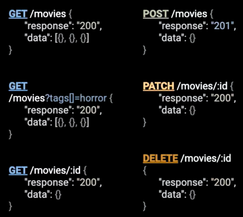

# Node.js

* Es un entorno de ejecución construido sobre V8, para correr JavaScript.
* Runtime Enviroment, es una capa ensima del sistema operativo que ejecuta una pieza de software, es la responsabel de decidir como consume la memoria, como accede a las variables, como pasar los parametros en los diferentes procedimientos, ademas sabe cuando y como debe ejecutar el gabage colector.

## Chrome V8

* Es un motor open source de JavaScript desarrollado por The Chrome Project.
* Just in time compiler compila codigo javascript.
* JavaScript es interpretado.
* Compila codigo JavaScript a lenguaje de maquina.

## Arquitectura Orientada a eventos

* Esta nos permite manejar un codigo asíncrono de una mejor manera.

## Stream

* Una coleccion de datos similar a un array o cadenas de texto, solo que en vez de estar en su totalidad se maneja pedazo a pedazo.

### Readable y Writable Streams

* Tienen eventos eventos (Heredan del EventEmitter) y funciones.
* Readable Stream
  * eventos:
    * *data:* Cuando recibe datos.
    * *end:* Cuando termina de recibir datos.
    * *error:* Cuando ocurre un error.
  * funciones:
    * pipe
    * read
    * push
* Writable
  * eventos:
    * *dream:* 
    * *finish:* Cuando termina de emitir datos
    * *error:* Un error mientras se hace la comunicacion de datos
  * funciones
    * end
    * write

## Debugin

```bash
node --inspect archivo.js
```

## Express.js

* Es un framework para crear aplicasiones web, asi como tambien APIs. Fue inspirado por Sinatra (Ruby)  y desarrollado por TJ Holowaychuk.

### Caracteísticas

* Minimialista: Es muy liviando y minimalista, si se necesita algo mas se puede agregar como plugin
* Template engines: Pug, Mustash o Handlebars y permite agragar mi propio template engine.
* Routing: Wide cards en las rutas, esto permite manejar expresiones regulares y asi capturar parametros.
* Middlewares: Interceptan el request y response y llamar por el middeware que sigue.
* Plugins (como middlewares): Vienen como middlewares.

### Formateo automático

Agregando un hook para que el codigo se haga formato automático cada vez que se hace commit y se sube al repositorio:

```bash
npx mrm lint-staged
```

Esto modifica el package.json y le indica que cada vez que se realice un commit va cojer todo el codigo y lo va formatear deacuerdo a la configuración de prettier y va subir el código.

## API Restful

* Representation and estate transfer.
* Es un estilo de arquitectura para construir servicios web no es un estandar pero hay uan especificación creada por Roy Fielding (Apache Software Foundation).

#### Verbos HTTP




## Capa de Servicios

Vesion simplificada de Clean Architecture.


* Un controlador no puede llamar a otro controlador.
* Un servicio si puede llamar a otro servicio.

## Middleware

* Es una pieza de software que esta en medio de otras 2, se lo suede describir como pegamento de software.
* Ayuda conectar otras piesas de software.
* Los middlewares tienen tres parametros (request, response, next)
* Un middleware de error es especial porque este recibe 4 parámetrtos (error, request, response, next).

## Validación de datos

### Joi y Boom

* Son tecnologías de Happi.js.
* Joi (Object Schema Validation): Nos ayuda a validar los esquemas.
* Boom (HTTP-friendly error objects): Es un manejador de errores de una forma más comprensiva.