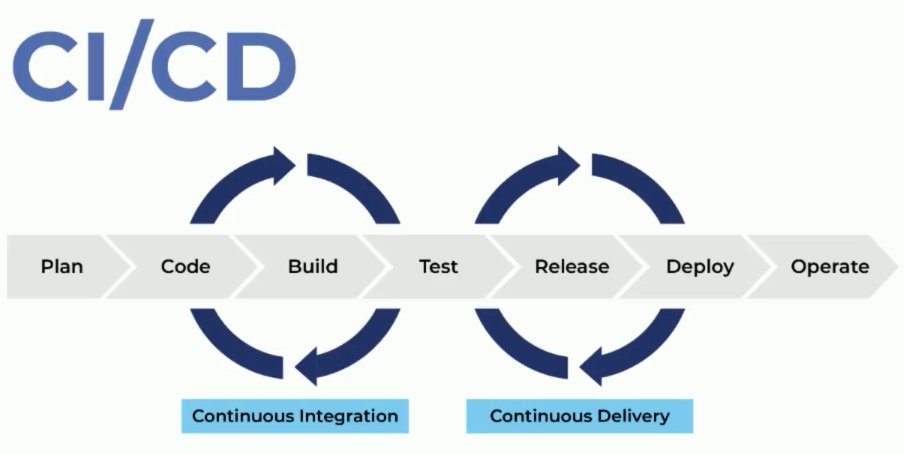

* Nos ayuda a ser más ágiles a la hora de mandar nuestro código a producción
* Probar bloques de código con el fin de validar que estamos entregando software de calidad.

## Continuous Integration (CI)

* Planeación del proyecto.
* Fase de desarrollo donde se agrega los features.
* Integración del código sin molestar al código existente.
* Pruebas.

## Continuous Delivery (CD)

* Generar un release.
* Enviar a producción. Generar un deploy.

## Travis

* Se debe crear una cuenta pero solo funciona con github.

* URL: travis-ci.org

* Todos los proyectos deben ser Open Source para trabajar con Travis, para la version gratuita.

* La versión pagada en travis-ci.com.

* Permisos que solicita de GitHub: Organizaciones y equipos, commits y estados, sistema de deployment, datos personales, repositorios, hooks y servicios que vamos a incorporar dentro de github.

* El archivo travis.yml es necesario para trabajar con la configuración del proyecto.

* Puede trabajar con proyectos escritos en cualquier lenguaje.

* Se puede indicar la profundidad de lectura que va tener del repositorio de GIT. Para tener una historia o tener el avance del proyecto.

  ```yaml
  git:
  	depth: 3
  ```

* La configuración de travis suele tener por defecto a yarn también para trabajar con paquetes de node.js.

* Travis por defecto va ejecutar por su cuenta la instalación de las dependencias.

* Al ejecutar el build

  * El worker empieza a construir toda la implementación el cual es un servdor encargado de obener la información del repositorio, ejecutar los script y ejecutar el deploy.

* Por cada cambio que se suba a master va ejecutar las pruebas o el build.

* Webhooks para poder tener conxion con los servicios e travis y con heroku.

* Para trabajar con proyectos privados se debe trabajar con la opción de pago que tiene travis.

## YAML

* Su lenguaje es muy fácil de entender y de estructurar.
* Esta inspirado en lenguajes como Python, XML y C.
* Tiene una propuesta del año 2001 para ser mas fácil la lectura de las configuraciones.

## Travis CLI

Encriptar:

```bash
travis encrypt string_a_encriptar
```


```
notifications:
	slack:
		secure:
		"KEY ENCRIPTADA"
deploy:
	api_key:
		secure:
		"KEY ENCRIPTADA"
```


